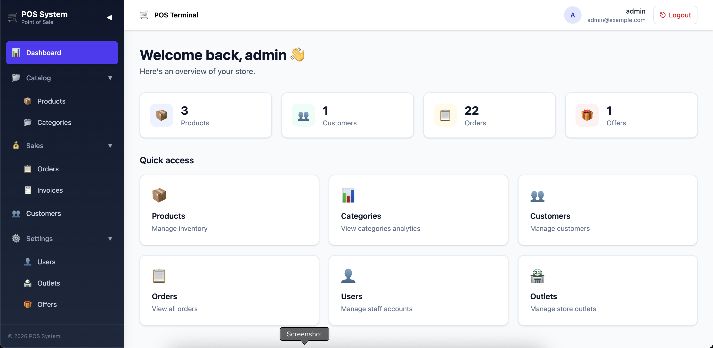
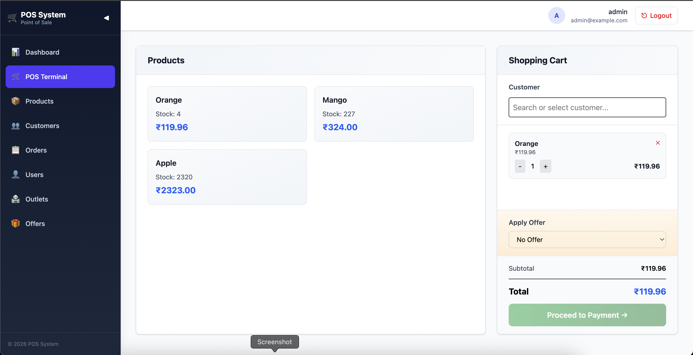
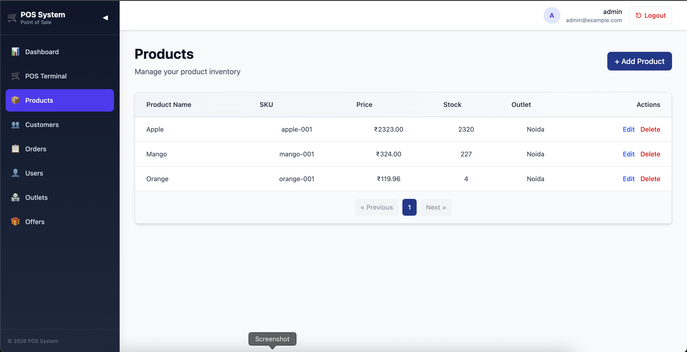
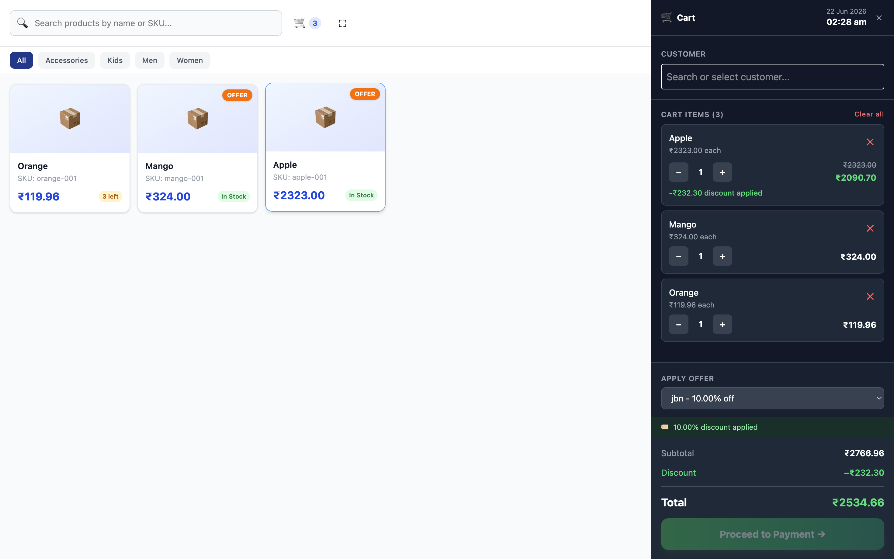

# POS System

A multi-outlet Point of Sale (POS) application built with Laravel and React, featuring role-based access control, outlet-scoped data, and support for both admin management and POS agent workflows.

## Tech Stack

| Layer | Technology |
|-------|-----------|
| Backend | Laravel 13.8 (PHP 8.3+) |
| Frontend | React 18.3, Inertia.js 2 |
| Styling | TailwindCSS v4 |
| Bundler | Vite 6 |
| Auth | Laravel Breeze + Sanctum |
| Database | MySQL / SQLite |

## Features

- **Dual Authentication** — Separate admin web guard and POS agent guard
- **Role-Based Access Control** — Roles and permissions system with middleware enforcement
- **Multi-Outlet Support** — Outlet-scoped data for products, customers, orders, and carts
- **POS Terminal** — Product search, cart management, checkout, and payment
- **Order Management** — Order history, status updates, and cancellation
- **Product Management** — CRUD for products with stock tracking
- **Customer Management** — Customer profiles linked to orders
- **Offers & Discounts** — Fixed and percentage offers with date ranges
- **Dashboard** — Stats overview scoped to the user's outlet

## Images









## User Roles

| Role | Access |
|------|--------|
| **Admin** | Full access to management area (products, users, outlets, offers) and POS terminal |
| **POS Agent** | Restricted to POS terminal and their assigned outlet's data only |

## Database Schema

Core tables:
- `users` — Staff accounts (`can_access_pos`, `is_active`, `outlet_id`)
- `outlets` — Store locations
- `roles` — Role definitions with permissions
- `permissions` — Granular permission slugs
- `role_user` — User-to-role assignments (outlet-aware)
- `permission_role` — Role-to-permission mappings
- `products` — Product catalog with stock and outlet scoping
- `customers` — Customer records with outlet scoping
- `carts` / `cart_items` — Per-user POS carts
- `orders` / `order_items` — Completed transactions
- `offers` — Discount campaigns (fixed, percentage)

## Prerequisites

- PHP 8.3+
- Composer
- Node.js 18+
- MySQL or SQLite

## Installation

```bash
composer install
cp .env.example .env
php artisan key:generate
```

Configure your database in `.env`, then run:

```bash
php artisan migrate --force
php artisan db:seed
npm install --ignore-scripts
npm run build
```

### Default Admin Login

After installation, you can log in with the default admin credentials:

| Field | Value |
|-------|-------|
| URL | `/pos/login` |
| Email | `admin@example.com` |
| Password | `admin123` |

> ⚠️ **Change these credentials immediately** after first login.

## Development

Start the full development stack (server, queue, logs, Vite) with one command:

```bash
composer dev
```

Or run services individually:

```bash
# Laravel server
php artisan serve

# Queue worker
php artisan queue:listen --tries=1 --timeout=0

# Logs (Pail)
php artisan pail --timeout=0

# Frontend
npm run dev
```

## Testing

```bash
composer test
```

## Scripts

| Script | Description |
|--------|-------------|
| `composer setup` | Install, configure, migrate, and build |
| `composer dev` | Run full dev stack concurrently |
| `composer test` | Run PHPUnit tests |

## Project Structure

```
app/
├── Http/
│   ├── Controllers/
│   │   ├── PosController.php        # POS terminal & dashboard
│   │   ├── OrderController.php      # Order management
│   │   ├── ProductController.php    # Product CRUD (admin)
│   │   ├── CustomerController.php   # Customer management
│   │   ├── CartController.php       # Cart operations
│   │   ├── PaymentController.php    # Payment page
│   │   ├── OfferController.php      # Offers CRUD (admin)
│   │   ├── UserController.php       # User management (admin)
│   │   ├── OutletController.php     # Outlet management (admin)
│   │   └── RoleController.php       # Role management (admin)
│   ├── Middleware/
│   │   ├── CheckRole.php            # Role-based access
│   │   ├── CheckPermission.php      # Permission-based access
│   │   ├── PreventPosAccess.php     # Block POS agents from admin routes
│   │   └── CheckOutletAccess.php    # Outlet context middleware
│   └── Requests/
routes/
├── web.php        # POS routes (auth:pos guard)
└── auth.php       # Admin auth routes (web guard)
resources/
└── js/
    └── Pages/
        ├── Pos/Index.jsx           # POS terminal page
        ├── Dashboard.jsx           # Admin dashboard
        ├── Products/               # Product management pages
        ├── Customers/              # Customer management pages
        ├── Orders/                 # Order history & status
        ├── Offers/                 # Offers management
        ├── Users/                  # User management
        ├── Outlets/                # Outlet management
        └── Roles/                  # Roles & permissions
database/
├── migrations/     # All schema migrations
└── seeders/
    └── DatabaseSeeder.php
```

## Workflow

1. **Admin Registration** — Register via the web auth routes (`/register`)
2. **Outlet Setup** — Create outlets to organize store locations
3. **Role Assignment** — Create roles, assign permissions, assign users to roles
4. **Product & Customer Setup** — Add products and customers scoped to outlets
5. **POS Login** — POS agents log in at `/pos/login`
6. **Terminal Operations** — Select products, build cart, apply offers, checkout
7. **Order Processing** — Orders are created asynchronously via `ProcessOrderJob`

## License

MIT
